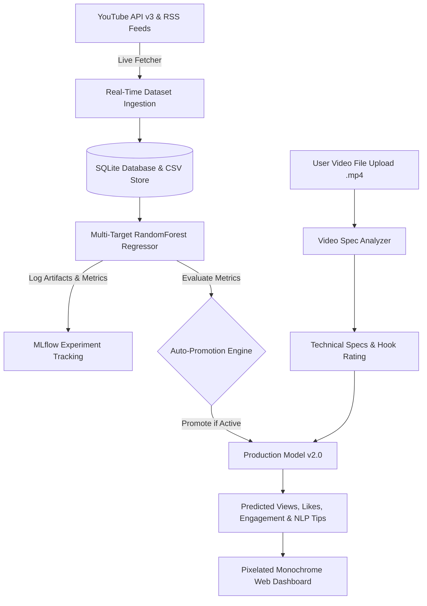

# 🎮 CreatorIQ AI — AI Creator Success Predictor & Recommendation System

[](https://www.python.org/)
[](https://fastapi.tiangolo.com/)
[](https://reactjs.org/)
[](https://vitejs.dev/)
[](https://www.docker.com/)
[](https://mlflow.org/)
[](https://github.com/features/actions)

> **CreatorIQ AI** is an end-to-end **Machine Learning Operations (MLOps)** production web platform built to empower social media content creators. It combines multi-target machine learning forecasting, YouTube Data API v3 real-time ingestion, deep video file technical analysis, NLP content optimization, automated 5-second Continuous Training (CT) model promotion, and a retro **Pixelated Black & Gray** user interface.

---

## 📌 Executive Overview

In modern social media publishing, content performance (views, likes, comments, and engagement) depends heavily on title hooks, media formatting, posting schedules, and channel baselines.

**CreatorIQ AI** automates the entire MLOps lifecycle:
1. **Real-time Web Data Ingestion:** Collects trending content metadata from YouTube Data API v3, YouTube RSS feeds, and Reddit APIs.
2. **Multi-Target ML Inference:** Predicts expected Views, Likes, Comments, Engagement Rate, and overall Success Score (`0-100`).
3. **Deep Video File Analysis:** Extracts technical specs (4K/1080p resolution, duration, bitrate) from uploaded `.mp4` video files and generates technical optimization advice.
4. **Automated Continuous Training (CT):** Runs a background 5-second worker loop that automatically ingests new data, trains a `RandomForestRegressor` multi-output model, tracks metrics in MLflow, and auto-promotes the best model version to production.
5. **Interactive Analytics:** Tracks published actual views vs predicted views, automatically calculating prediction error rates.

---

## 📐 System Architecture

```
                                  ┌───────────────────────────────┐
                                  │   Pixelated React Frontend    │
                                  │   (Vite + Tailwind + Pixel)   │
                                  └───────────────┬───────────────┘
                                                  │
                                                  ▼ (REST API / JSON)
                                  ┌───────────────────────────────┐
                                  │        FastAPI Backend        │
                                  │      (Uvicorn ASGI Engine)    │
                                  └───────┬───────────────┬───────┘
                                          │               │
                  ┌───────────────────────┘               └───────────────────────┐
                  ▼                                                               ▼
  ┌───────────────────────────────┐                               ┌───────────────────────────────┐
  │     ML & NLP Pipeline         │                               │       SQLite Database DB      │
  │ (Scikit-Learn/MLflow/YouTube) │                               │        (SQLAlchemy ORM)       │
  └───────────────────────────────┘                               └───────────────────────────────┘
```



---

## ✨ Key Features & Capabilities

### 1. 🤖 Multi-Target Machine Learning Engine
* **Targets Predicted Simultaneously:**
  - **Predicted Views** (Total expected views)
  - **Predicted Likes** (Expected audience likes)
  - **Predicted Comments** (Expected audience comments)
  - **Engagement Rate** `(Likes + Comments) / Views`
  - **Overall Success Score** (`0.0 to 100.0`)
* **Core Algorithm:** `RandomForestRegressor` wrapped in multi-output regression pipelines with `StandardScaler` and `OneHotEncoder`.

### 2. 🌐 YouTube Data API v3 & Real-Time Data Ingestion
* Queries YouTube Data API v3 (`https://www.googleapis.com/youtube/v3/videos?part=snippet,statistics`) for live trending videos across categories (**Tech, Gaming, Education, Vlog, Music**).
* Features fallback handling to YouTube Atom RSS feeds and Reddit APIs (`r/technology`, `r/gaming`).

### 3. 🎥 Deep Video File Analyzer
* Drag & drop video file uploader supporting `.mp4`, `.webm`, and `.mov`.
* Technical spec extraction:
  - **Estimated Resolution:** 4K Ultra HD (2160p), Full HD (1080p), HD (720p), SD (480p).
  - **File Size & Bitrate:** Real-time MB size and bitrate calculation (~8.5 Mbps).
  - **Duration Formatting:** Formats estimated length in minutes and seconds.
* Evaluates **Technical Production Score (0-100)** and **Title Hook CTR Potential Score (0-100)**.

### 4. ⚡ Automated 5-Second Continuous Training (CT) & Auto-Promotion Loop
* **Background Worker:** Runs an `asyncio` background loop every 5 seconds.
* Automatically fetches live web trends, trains a new model version, evaluates MAE/$R^2$ metrics, logs artifacts to MLflow, and auto-promotes the new version to `is_active = True`.
* **Zero Manual Effort:** No manual button clicks needed; the frontend auto-refreshes metrics every 5 seconds.

### 5. 🕹️ Monochromatic Pixelated Black & Gray Retro Web UI
* Custom CSS pixel styling engine featuring **'Pixelify Sans'**, **'VT323'**, and **'Press Start 2P'** retro arcade Google fonts.
* Monochrome pitch-black (`#050505`) layout with charcoal cards (`#0f0f11`), 2px hard zinc borders (`#3f3f46`), pixel block shadows, and tactile press button animations.

### 6. 📊 Interactive Analytics & Actuals Tracker
* Displays **Predicted vs Actual Published Views** line charts.
* Includes an interactive **`[SET ACTUAL]`** button: creators type their real published views (e.g. `85,000`), click **SAVE**, and the system automatically calculates the prediction error rate!

---

## 🛠️ Technology Stack

| Domain | Technologies Used |
|---|---|
| **Frontend UI** | React 18, TypeScript, Vite, Tailwind CSS v4, Recharts, Lucide Icons |
| **Backend REST API** | Python 3.10+, FastAPI, Uvicorn, Pydantic, SQLAlchemy, SQLite |
| **Machine Learning & NLP** | Scikit-learn, XGBoost, MLflow, Pandas, NumPy |
| **Data Ingestion** | YouTube Data API v3, Requests, XML ElementTree RSS Parser |
| **DevOps & CI/CD** | GitHub Actions, Pytest, Docker, Docker Compose |

---

## 📁 Repository Directory Structure

```
MLOPS PROJECT/
├── .github/
│   └── workflows/
│       └── mlops-pipeline.yml         # GitHub Actions CI/CD Pipeline
├── backend/
│   ├── app/
│   │   ├── api/
│   │   │   ├── analytics.py           # Analytics overview & actuals recording
│   │   │   ├── datasets.py            # Dataset upload & live sync endpoints
│   │   │   ├── models.py               # Model registry & promotion endpoints
│   │   │   ├── predict.py              # ML prediction & recommendation endpoints
│   │   │   └── videos.py               # Video file upload & analysis endpoints
│   │   ├── database/
│   │   │   └── database.py            # SQLite & SQLAlchemy engine setup
│   │   ├── models/
│   │   │   └── models.py              # Database ORM models (Dataset, MLModel, Prediction)
│   │   ├── schemas/
│   │   │   └── schemas.py             # Pydantic request/response validation schemas
│   │   └── main.py                    # FastAPI application & 5s Auto CT worker loop
│   ├── ml/
│   │   ├── analysis/
│   │   │   └── video_analyzer.py      # Video file technical analyzer & quality scorer
│   │   ├── features/
│   │   │   └── nlp_features.py        # Rule-based NLP title/hashtag optimizer
│   │   ├── inference/
│   │   │   └── predictor.py           # Multi-target ML predictor service
│   │   ├── ingestion/
│   │   │   ├── live_fetcher.py        # Live RSS & Reddit dataset fetcher
│   │   │   └── youtube_api.py         # YouTube Data API v3 integration
│   │   └── training/
│   │       └── train.py               # Scikit-learn multi-output training & MLflow tracker
│   └── requirements.txt               # Backend Python dependencies
├── frontend/
│   ├── public/                        # Static public assets
│   ├── src/
│   │   ├── assets/                    # Styling assets & icons
│   │   ├── pages/
│   │   │   ├── Analytics.tsx          # Predicted vs Actuals tracking page
│   │   │   ├── Dashboard.tsx          # Overview KPIs & recent predictions log
│   │   │   ├── DatasetExplorer.tsx    # Live data ingestion & dataset table
│   │   │   ├── ModelTraining.tsx      # Model registry & auto-training pipeline
│   │   │   ├── Predictor.tsx          # Content success prediction form
│   │   │   └── VideoAnalyzer.tsx      # Drag & drop video upload & analysis page
│   │   ├── services/
│   │   │   └── api.ts                 # Axios API service module
│   │   ├── App.tsx                    # Main App layout & pixel sidebar
│   │   ├── index.css                  # Pixelated Black & Gray CSS theme
│   │   └── main.tsx                   # React entrypoint
│   ├── Dockerfile.frontend            # Frontend Docker container definition
│   ├── package.json                   # Node.js dependencies
│   └── vite.config.ts                 # Vite build config
├── tests/
│   └── test_pipeline.py               # Pytest suite for prediction & NLP contracts
├── Dockerfile.backend                 # Backend Docker container definition
├── docker-compose.yml                 # Multi-container orchestration config
├── creator_iq.db                      # SQLite database file
├── README.md                          # Project documentation
└── .gitignore                         # Git exclusion patterns
```

---

## 🚀 Quickstart & Installation

### Option A: Running with Docker Compose (Recommended)

1. **Clone the repository:**
   ```bash
   git clone https://github.com/Elangkaviyan/MLOPS_PROJECT.git
   cd MLOPS_PROJECT
   ```

2. **Launch all services using Docker Compose:**
   ```bash
   docker-compose up --build
   ```

3. **Access the applications:**
   - **Pixelated Web UI:** [http://localhost:5173](http://localhost:5173) (or port `80`)
   - **Backend API:** [http://localhost:8000](http://localhost:8000)
   - **Interactive API Documentation:** [http://localhost:8000/docs](http://localhost:8000/docs)

---

### Option B: Local Development Execution

#### 1. Setup Backend (FastAPI + Python ML)

```powershell
# Navigate to project root
cd "E:\MLOPS PROJECT"

# Create and activate virtual environment
python -m venv venv
.\venv\Scripts\activate

# Install Python dependencies
pip install -r backend/requirements.txt

# Set Python Path & start FastAPI server
$env:PYTHONPATH="E:\MLOPS PROJECT"
uvicorn backend.app.main:app --host 127.0.0.1 --port 8000 --reload
```

#### 2. Setup Frontend (React + Vite)

```bash
# Open a new terminal and navigate to frontend
cd frontend

# Install Node.js dependencies
npm install

# Start Vite development server
npm run dev
```

The frontend will run at [http://localhost:5173](http://localhost:5173).

---

## 📡 API Endpoints Reference

| Category | Method | Endpoint | Description |
|---|---|---|---|
| **System** | `GET` | `/` | API status & Auto CT interval specs |
| **System** | `GET` | `/api/health` | Backend service health check |
| **Prediction** | `POST` | `/api/predict/` | Predicts Views, Likes, Comments & Engagement Rate |
| **Prediction** | `POST` | `/api/predict/recommendations` | Generates NLP title & hashtag optimizations |
| **Video Upload** | `POST` | `/api/videos/analyze` | Accepts `.mp4` video upload; returns technical specs & quality rating |
| **Datasets** | `GET` | `/api/datasets/` | Lists all datasets (Live, Synthetic, Uploaded) |
| **Datasets** | `POST` | `/api/datasets/sync_live` | Ingests real-time YouTube/Reddit trends & triggers retraining |
| **Datasets** | `POST` | `/api/datasets/generate_sample` | Generates 1,000 synthetic benchmark rows |
| **Datasets** | `POST` | `/api/datasets/upload` | Uploads custom CSV dataset |
| **Models** | `GET` | `/api/models/` | Lists trained model versions with MAE & $R^2$ metrics |
| **Models** | `GET` | `/api/models/active` | Gets current production active model |
| **Models** | `POST` | `/api/models/auto-retrain` | Triggers immediate automated retraining & auto-promotion |
| **Models** | `POST` | `/api/models/{id}/promote` | Manually promotes model version to active |
| **Analytics** | `GET` | `/api/analytics/overview` | Aggregated system metrics (Total analyzed, avg score) |
| **Analytics** | `GET` | `/api/analytics/history` | Retrieves prediction log history |
| **Analytics** | `POST` | `/api/analytics/actual-performance` | Records published actual views & calculates error rate |

---

## 🧪 Testing & CI/CD Pipeline

The project includes an automated **GitHub Actions MLOps Workflow** ([`.github/workflows/mlops-pipeline.yml`](.github/workflows/mlops-pipeline.yml)) configured to run on every commit:

1. **Backend Tests:** Executes `pytest tests/` verifying ML prediction contracts and NLP recommendation algorithms.
2. **Frontend Validation:** Executes `npm run build` ensuring 0 TypeScript compilation errors.
3. **Docker Build Checks:** Validates container builds for both backend and frontend.

### Run Unit Tests Locally

```bash
python -m pytest tests/
```

---

## 👤 Author & Maintainer

* **Developer & Architect:** [Elangkaviyan](https://github.com/Elangkaviyan)
* **Project Name:** AI Creator Success Predictor & Recommendation System
* **Repository:** [https://github.com/Elangkaviyan/MLOPS_PROJECT.git](https://github.com/Elangkaviyan/MLOPS_PROJECT.git)
* **License:** MIT License
